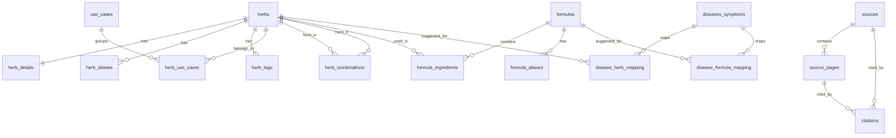

# Admin Management Blueprint

This document maps the current `database_schema.sql` into an admin system for managing Celestial Ring content.

## 1. Database Diagram Structure

## 2. Admin Modules

### Dashboard

Purpose: operational overview.

Cards:

- Total herbs.
- Published herbs.
- Draft / needs review count.
- Toxic or forbidden herbs.
- Formulas count.
- Dangerous combinations count.
- OCR pages pending cleanup.
- Citations missing confidence score.

Tables:

- Recently edited herbs.
- Items waiting for review.
- High-risk content without citation.

### Herb Admin

Primary tables:

- `herbs`
- `herb_details`
- `herb_aliases`
- `herb_tags`
- `herb_use_cases`
- `citations`
- `editorial_reviews`

List view columns:

- Name VN.
- Scientific name.
- Group category.
- Nature.
- Flavor.
- Meridian.
- Toxicity.
- Demand.
- Status.
- Updated at.

Filters:

- Status.
- Toxicity level.
- Group category.
- Nature.
- Demand.
- Use case.
- Has citation / missing citation.

Edit tabs:

- Core: slug, names, scientific name, family, category, nature, flavor, meridian, part used.
- Safety: caution, toxicity level, demand, image.
- Details: description, uses, preparation, dosage, basic summary, detailed usage, modern safety note.
- Aliases: folk names, Hán Việt, OCR variants, Latin variants.
- Tags/use cases.
- Citations.
- Review history.

Important validation:

- `slug` unique.
- `name_vn` required.
- If `toxicity_level` is `high`, `toxic`, or `forbidden`, require `caution`.
- If status is `published`, require at least one citation.
- If status is `published`, require `dosage` or explicit reason why dosage is omitted.

### Formula Admin

Primary tables:

- `formulas`
- `formula_aliases`
- `formula_ingredients`
- `citations`
- `editorial_reviews`

List view columns:

- Name.
- Category.
- Source.
- Ingredient count.
- Has toxic ingredient.
- Status.
- Updated at.

Edit tabs:

- Core: slug, name, name Hán, source, category.
- Indication and preparation.
- Description and caution.
- Ingredients: searchable herb picker, dosage, role, preparation note, sort order.
- Aliases.
- Citations.
- Review history.

Important validation:

- Formula must have at least 2 ingredients before publish.
- Ingredient `role` should be one of `quan`, `than`, `ta`, `su`, `other`.
- If any ingredient is toxic, show blocking warning before publish.
- Published formula requires `caution` and citation.

### Herb Combination Admin

Primary table:

- `herb_combinations`

List view columns:

- Herb A.
- Herb B.
- Combination type.
- Is dangerous.
- Severity.
- Source rule.
- Status.

Edit fields:

- Herb A.
- Herb B.
- Combination type.
- Effect.
- Warning text.
- Is dangerous.
- Severity.
- Source rule.
- Citation.

Important validation:

- Herb A and Herb B cannot be the same.
- Store lower id as `herb_a_id` and higher id as `herb_b_id`.
- If `combination_type = tuong_phan`, force `is_dangerous = true`.
- If `is_dangerous = true`, require `warning_text`.

### Symptom / Disease Admin

Primary tables:

- `diseases_symptoms`
- `disease_herb_mapping`
- `disease_formula_mapping`

List view columns:

- Name.
- Type.
- Status.
- Number of mapped herbs.
- Number of mapped formulas.

Edit tabs:

- Core: slug, name, type, description, safety note.
- Related herbs: herb, rationale, caution, evidence level.
- Related formulas: formula, rationale, caution, evidence level.
- Citations.
- Review history.

Important UX rule:

- Admin copy should say "liên quan/tham khảo theo biện chứng", not "chữa khỏi".

### Source / OCR Admin

Primary tables:

- `sources`
- `source_pages`
- `citations`

List view columns:

- Title.
- Author.
- Kind.
- Total pages.
- Extraction status.
- OCR pages count.
- Cleaned pages count.

Source detail tabs:

- Metadata.
- PDF/local path/external URL.
- Pages.
- OCR text.
- Cleaned text.
- Citations created from this source.

OCR page workflow:

1. `scan_needs_ocr`
2. `ocr_done`
3. `cleaned`
4. `verified`

Recommended page editor:

- Left: page image.
- Middle: OCR text.
- Right: cleaned text and detected herb/formula names.

### Citation Admin

Primary table:

- `citations`

Purpose:

- Attach source evidence to herbs, formulas, combinations, symptoms, and source pages.

Fields:

- Entity type.
- Entity id.
- Source.
- Source page.
- Page start/end.
- Citation label.
- Short quote excerpt.
- Editorial note.
- Confidence 1-5.

Important validation:

- Keep quote excerpts short.
- Published medical content should have confidence >= 3, unless manually approved.

### Editorial Review Admin

Primary tables:

- `editorial_reviews`
- `audit_log`

Queues:

- Draft.
- Needs review.
- Reviewed but not published.
- Published.
- Archived.
- High-risk safety queue.
- Missing citation queue.

Review actions:

- Request changes.
- Mark reviewed.
- Publish.
- Archive.

Every action should write `audit_log`.

## 3. Admin Navigation

Recommended sidebar:

- Overview
- Herbs
- Formulas
- Pairing Rules
- Symptoms & Search
- Sources & OCR
- Citations
- Review Queue
- Taxonomy
- Audit Log

## 4. API / Service Layer

Suggested endpoints:

- `GET /admin/dashboard`
- `GET /admin/herbs`
- `POST /admin/herbs`
- `GET /admin/herbs/:id`
- `PATCH /admin/herbs/:id`
- `POST /admin/herbs/:id/publish`
- `GET /admin/formulas`
- `POST /admin/formulas`
- `PATCH /admin/formulas/:id`
- `POST /admin/formulas/:id/ingredients`
- `GET /admin/combinations`
- `POST /admin/combinations`
- `GET /admin/symptoms`
- `GET /admin/sources`
- `GET /admin/sources/:id/pages`
- `PATCH /admin/source-pages/:id`
- `POST /admin/citations`
- `GET /admin/review-queue`
- `POST /admin/reviews`

## 5. Implementation Priority

Phase 1:

- Replace current unused ecommerce admin components.
- Build local admin shell: sidebar, dashboard, list/detail layout.
- Implement Herb Admin against static/local data first.

Phase 2:

- Formula Admin.
- Combination Admin.
- Source Library and OCR page review.

Phase 3:

- Real backend API.
- PostgreSQL migration.
- Auth roles: admin, editor, reviewer, viewer.
- Audit log and publish workflow.

## 6. Roles

- Admin: full access, schema/taxonomy/source management.
- Editor: create and edit drafts.
- Reviewer: approve, request changes, publish.
- Viewer: read-only admin access.

## 7. Safety Rules

- Toxic herbs must show red labels in both admin and public UI.
- Dangerous combinations must block publish unless reviewed.
- Formula with toxic ingredient must require caution and citation.
- Disease/symptom mappings must be informational, not diagnostic.
- Public content should never imply guaranteed treatment.
