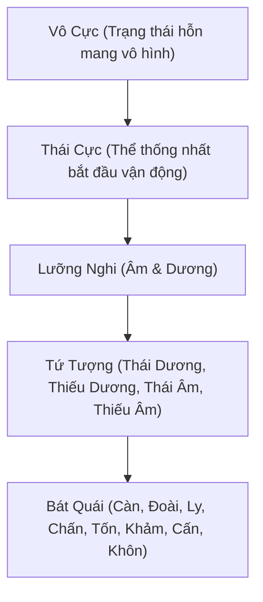

# CHƯƠNG I: HỌC THUYẾT ÂM DƯƠNG (THE GREAT YIN-YANG THEORY)

Học thuyết Âm Dương không chỉ là nền tảng triết học Đông Á cổ đại mà còn là kim chỉ nam tối cao xuyên suốt mọi hoạt động từ lý luận cơ bản, giải phẫu, sinh lý đến chẩn trị lâm sàng và bào chế của Y học cổ truyền (YHCT). Việc thấu hiểu bản chất chuyển hóa liên tục của hai lực đối cực này giúp người thầy thuốc thiết lập lại trạng thái cân bằng khí hóa tối ưu cho người bệnh.

---

## 1. Bản chất Vũ trụ và Triết lý Cốt lõi

Triết lý Đông y quan niệm vũ trụ ban đầu là một thể hỗn mang vô hình gọi là **Vô Cực**. Từ Vô Cực sinh ra **Thái Cực** (thể thống nhất chứa đựng mầm mống chuyển động). Khi Thái Cực bắt đầu vận động, nó phân chia thành hai trạng thái đối lập nhưng nương tựa vào nhau, gọi là **Lưỡng Nghi** (Âm và Dương).



Sự tương tác liên tục giữa hai lực lượng này tạo ra vạn vật. Âm và Dương không phải là các chất cụ thể, mà là các phạm trù mô tả thuộc tính đối lập tồn tại trong mọi sự vật, hiện tượng:

*   **Dương (Yang - Bản chất động)**: Đại diện cho ánh sáng, sức nóng (nhiệt), sự chuyển động hướng lên và hướng ra ngoài (thăng phát, phát tán), trạng thái vô hình (khí hóa), hưng phấn, nam tính, và các hoạt động công năng của tạng phủ.
*   **Âm (Yin - Bản chất tĩnh)**: Đại diện cho bóng tối, sự lạnh lẽo (hàn), trạng thái tĩnh lặng hướng xuống và hướng vào trong (trầm giáng, thu liễm), trạng thái hữu hình (vật chất cơ thể), ức chế, nữ tính, và phần huyết dịch, tinh hoa tích trữ.

> [!NOTE]
> Bản chất của Âm Dương là tương đối. Trong Âm có Dương (Âm trung hữu Dương) và trong Dương có Âm (Dương trung hữu Âm). Một vị thuốc hay một cơ quan không bao giờ hoàn toàn thuần Âm hay thuần Dương, mà luôn chứa đựng mầm mống của mặt đối lập.


---

## 2. Bốn Quy luật Vận động Vĩ đại trong Đời sống Sinh học

Mọi sự sinh trưởng, biến hóa, suy thoái và tiêu vong của cơ thể sinh học đều tuân thủ nghiêm ngặt bốn quy luật tương tác Âm Dương:

### Quy luật 1: Âm Dương đối lập (Mâu thuẫn và Chế ước lẫn nhau)
Hai mặt Âm Dương luôn luôn đấu tranh, chế ngự và kiềm chế lẫn nhau để duy trì sự cân bằng động.
*   **Trong Sinh lý**: Cơ thể luôn có sự đối kháng giữa các quá trình sinh học. Sức nóng của Dương khí sưởi ấm toàn thân, chống lại sự ngưng trệ của Âm hàn. Ngược lại, nguồn Âm dịch (máu, dịch khớp, tân dịch) liên tục làm mát, bôi trơn và kiềm chế không cho Dương hỏa bùng phát thiêu đốt cơ thể.
*   **Trong Bệnh lý**: Khi một bên suy yếu, bên kia sẽ trỗi dậy phá vỡ trạng thái cân bằng. Ví dụ, Dương khí suy giảm sẽ không chế ước được Âm hàn, dẫn đến chứng hàn lạnh (Dương hư sinh ngoại hàn).

### Quy luật 2: Âm Dương hỗ căn (Nương tựa và Nguồn gốc của nhau)
Hai mặt đối lập làm tiền đề tồn tại cho nhau; không mặt nào có thể tồn tại độc lập mà thiếu đi mặt kia.
*   **Lý luận Y học**: *"Dương sinh ra từ Âm, Âm nương tựa vào Dương"*. Hay *"Vô âm tắc dương vô dĩ hóa, vô dương tắc âm vô dĩ sinh"*. Phần vật chất dinh dưỡng hữu hình (Âm) là nơi chứa đựng và sản sinh ra năng lượng hoạt động (Dương). Ngược lại, năng lượng hoạt động (Dương) lại thúc đẩy quá trình chuyển hóa, tiêu hóa để tích lũy vật chất dinh dưỡng (Âm).
*   **Sinh tử lâm sàng**: Nếu hai mặt này hoàn toàn chia lìa, không còn nương tựa vào nhau, sự sống sẽ lập tức chấm dứt. Y học cổ truyền gọi trạng thái này là **Âm Dương ly quyết**.

### Quy luật 3: Âm Dương tiêu trưởng (Thịnh suy chu kỳ)
Âm và Dương không đứng yên mà liên tục biến động, tiêu hao (tiêu) hoặc lớn mạnh (trưởng) theo chu kỳ thời gian hoặc diễn tiến bệnh lý.
*   **Chu kỳ Tự nhiên**: Từ nửa đêm (giờ Tý) đến giữa trưa (giờ Ngọ), Dương khí lớn dần (Dương trưởng) và Âm khí giảm đi (Âm tiêu). Từ giữa trưa đến nửa đêm, tiến trình đảo ngược (Âm trưởng, Dương tiêu).
*   **Chuyển hóa Bệnh tật**: Trong các bệnh truyền nhiễm cấp tính, sốt cao kéo dài (Dương vượng) sẽ thiêu đốt nguồn nước và máu của cơ thể (Âm tiêu). Nếu không được cứu chữa kịp thời bằng thuốc bổ âm, tân dịch sẽ cạn kiệt dẫn đến trụy tim mạch (Dương cũng tiêu vong theo).

### Quy luật 4: Âm Dương bình hành (Trạng thái cân bằng động)
Tất cả sự chuyển dịch tiêu trưởng đều nhằm duy trì một trạng thái cân bằng động tương đối gọi là **bình hành**. Sự cân bằng này giúp cơ thể thích nghi với môi trường sống xung quanh.
*   **Tương đương Sinh học Hiện đại**: Quy luật này tương đồng với cơ chế **hằng định nội môi (homeostasis)** của Tây y, duy trì nhiệt độ cơ thể ở 37°C, độ pH máu ổn định và sự cân bằng điện giải thông qua các hệ thống phản hồi ngược (feedback loop).

---

## 3. Ứng dụng trong Sinh lý, Bệnh học và Chẩn đoán Lâm sàng

### Cấu trúc Giải phẫu và Sinh lý Đông Y:
*   **Thuộc Dương**: Bề mặt cơ thể (biểu), phần lưng, nửa người phía trên, phía ngoài các chi, và chức năng vận động chuyển hóa (Khí). Vệ khí chạy ở biểu để bảo vệ cơ thể khỏi tà khí ngoại lai xâm nhập.
*   **Thuộc Âm**: Phần bên trong cơ thể (lý), phần bụng, nửa người phía dưới, phía trong các chi, và các vật chất dinh dưỡng tích lũy (Huyết, Tân dịch, Tinh).

### Biện chứng Khí - Huyết kinh điển:
Khí và Huyết là hai dạng vật chất và năng lượng cơ bản của sự sống, biểu hiện rõ nét của Âm Dương:
*   **Khí thuộc Dương**: Vô hình, chuyển động không ngừng, có tác dụng sưởi ấm, bảo vệ và thúc đẩy. *"Khí là soái của Huyết"* – Khí đi đến đâu, Huyết lưu thông đến đó; Khí suy thì Huyết ứ trệ.
*   **Huyết thuộc Âm**: Hữu hình, tĩnh lặng, mang chất dinh dưỡng nuôi cơ thể. *"Huyết là mẹ của Khí"* – Huyết mang dưỡng chất để tái tạo năng lượng Khí; Huyết mất thì Khí cũng tiêu tán (khí theo huyết thoát).

### Chẩn đoán Phân biệt Âm - Dương Chứng (Bát Cương):
Để điều trị đúng, thầy thuốc trước hết phải phân định rõ bệnh nhân đang mắc hội chứng thuộc Âm hay Dương bằng cách quan sát qua Tứ chẩn:

| Chỉ số Chẩn đoán | Hội chứng thuộc Âm (Âm Chứng) | Hội chứng thuộc Dương (Dương Chứng) |
| :--- | :--- | :--- |
| **Sắc diện (Vọng)** | Mặt trắng bệch hoặc tối sẫm, thần thái uể oải, thích nằm co | Mặt đỏ hồng, mắt đỏ xè, môi khô nứt nẻ, trằn trọc |
| **Âm thanh (Văn)** | Tiếng nói nhỏ yếu, thở khẽ, ngại giao tiếp | Tiếng nói to vang, thở thô hụt hơi, nói lảm nhảm |
| **Cảm giác (Vấn)** | Sợ lạnh, chân tay lạnh ngắt, thích uống nước ấm, tiểu trong dài | Sợ nóng, thích mát, khát nước lạnh dữ dội, tiểu đỏ ít |
| **Xem mạch (Thiết)** | Mạch Trầm (đi sâu dưới xương), Trì (chậm dưới 60 nhịp/phút), Tế (nhỏ như sợi chỉ), Nhược (yếu) | Mạch Phù (nổi rõ trên da), Sác (nhanh trên 90 nhịp/phút), Hồng (lớn mạnh như sóng cuộn), Thực (có lực) |
| **Xem rêu lưỡi** | Chất lưỡi nhạt bệu, có dấu răng, rêu lưỡi trắng trơn dính | Chất lưỡi đỏ thẫm hoặc gai đỏ, rêu lưỡi vàng khô dày |

---

## 4. Minh họa thuộc tính Âm Dương qua Dược tính Thảo dược

Y học cổ truyền sử dụng các thảo dược có tính chất đối lập để điều chỉnh sự thiên lệch Âm Dương trong cơ thể theo nguyên tắc: **"Hàn giả nhiệt chi, nhiệt giả hàn chi"** (Bệnh lạnh dùng thuốc nóng, bệnh nóng dùng thuốc lạnh) và **"Tả kỳ hữu dư, bổ kỳ bất túc"** (Dư thừa thì tả bớt, thiếu hụt thì bù vào).

### A. Vị thuốc đại biểu tính Dương tuyệt đối: Phụ tử chế (附子)


*   **Mô tả chi tiết hình ảnh minh họa**: 
    Bức họa watercolor tả thực Phụ tử chế cho thấy các lát cắt củ rễ hình bầu dục không đều, có các thớ gỗ co rút nhẹ do quá trình sấy hấp khô. Viền vỏ ngoài màu đen xám sần sùi bám bùn đất cổ kính đại diện cho phần Âm (đất đai tích tụ). Ngược lại, phần lõi gỗ bên trong có màu nâu vàng mật ong hoặc vàng xám đục, kết cấu chắc nịch với các đường vân tỏa ra như tia lửa nhỏ bị nén chặt. Sự xù xì, góc cạnh và màu sắc ấm nóng tỏa ra từ lõi lát thuốc thể hiện năng lượng động mãnh liệt của tính Dương hỏa, sẵn sàng bùng phát để đẩy lùi cái lạnh sâu kín trong cơ thể.
*   **Lý luận Dược tính & Cơ chế Khí hóa**:
    *   *Tính vị*: Vị cay, ngọt, tính đại nhiệt (nóng nhất trong dược liệu Đông y), có độc tính cao (nguyên bản chứa aconitine cực độc).
    *   *Quy kinh*: Tâm, Thận, Tỳ.
    *   *Cơ chế tác động*: Phụ tử chế có tác dụng **Hồi dương cứu nghịch** và **Bổ mệnh môn hỏa**. Khi cơ thể rơi vào tình trạng vong dương (dương khí thoát ly, chân tay lạnh toát quá khuỷu tay, mồ hôi vã ra như tắm, mạch vi muốn tuyệt), tính "đại nhiệt" của Phụ tử trực chỉ vào tạng Thận (Mệnh môn hỏa) và tạng Tâm, ngay lập tức nhen nhóm lại ngọn lửa sinh mệnh, thông mạch cứu sống bệnh nhân.
*   **Hóa học Dược lý & Nghệ thuật Bào chế**:
    Phụ tử sống (Sinh phụ tử) chứa hàm lượng alkaloid **aconitine** cực cao, tác động mạnh lên kênh natri của cơ tim gây loạn nhịp tim thất dữ dội và tử vong. Qua quá trình bào chế nghiêm ngặt (ngâm nước muối cô đặc, nấu kỹ nhiều giờ hoặc chưng hấp với phụ liệu), aconitine bị thủy phân thành **benzoylaconine** rồi đến **aconine** có độc tính chỉ bằng 1/2000 so với ban đầu nhưng vẫn giữ nguyên tác dụng kích thích tim mạch, tăng sức co bóp cơ tim, giúp nâng huyết áp và làm ấm cơ thể an toàn.
*   **Ứng dụng Phương tễ**: Là quân dược trong bài thuốc huyền thoại **Tứ Nghịch Thang** (gồm Phụ tử, Can khương, Cam thảo) chuyên trị các chứng chân tay lạnh ngắt, tiêu chảy mất nước nặng thuộc thể Thận dương hư thoát.

### B. Vị thuốc đại biểu tính Âm tuyệt đối: Thục địa (熟地)


*   **Mô tả chi tiết hình ảnh minh họa**:
    Khác biệt hoàn toàn với vẻ khô ráo, sắc sảo của Phụ tử, Thục địa được minh họa bằng những khối củ đen sẫm óng ánh như đá hắc diệu thạch (obsidian). Bề mặt củ dẻo quánh, mọng nước dịch chưng cất, phản chiếu ánh sáng dịu nhẹ dưới dạng một lớp dầu bóng mượt trên bề mặt lồi lõm tròn trịa. Hình dáng bo tròn mềm mại không góc cạnh đại diện cho tính chất nhu nhuận, trầm tĩnh, ôm ấp của dòng nước (hành Thủy). Màu đen sâu thẳm trực chỉ tạng Thận ở hạ tiêu, thể hiện khả năng lưu trữ, tích lũy tinh hoa vật chất tối đa của thuộc tính Âm dịch.
*   **Lý luận Dược tính & Cơ chế Khí hóa**:
    *   *Tính vị*: Vị ngọt, tính hơi ấm (ôn nhẹ sau bào chế).
    *   *Quy kinh*: Can, Thận.
    *   *Cơ chế tác động*: Thục địa có tác dụng **Tư âm bổ huyết** và **Bổ thận điền tinh**. Chất dẻo nhầy và vị ngọt đậm đà của thuốc giúp sinh tân dịch, tái tạo hồng cầu, bổ sung nguồn tinh hoa đã mất cho Thận âm. Khi Thận âm bị suy tổn dẫn đến chứng bốc hỏa, triều nhiệt (sốt chiều), ra mồ hôi trộm, khô khát, tính chất nhu nhuận của Thục địa hoạt động như một nguồn nước mát thấm sâu xuống hạ tiêu dập tắt ngọn lửa hư hỏa bùng phát vô cớ.
*   **Hóa học Dược lý & Nghệ thuật Bào chế**:
    Để biến Sinh địa (mát, tính hàn) thành Thục địa (ấm, bổ), người xưa dùng phương pháp **Cửu chưng cửu sái** (9 lần chưng hấp với rượu và dịch nước gừng, 9 lần phơi nắng). Quá trình nhiệt phân liên tục này bẻ gãy các iridoid glycoside hoạt tính lạnh (như catalpol) thành các mảnh phân tử nhỏ hơn, đồng thời làm tăng nồng độ các hợp chất monosaccharide và polysaccharide dồi dào dinh dưỡng. Hợp chất này giúp tăng sinh tế bào máu trong tủy xương, chống oxy hóa mạnh mẽ và điều hòa hệ miễn dịch.
*   **Ứng dụng Phương tễ**: Thục địa là quân dược cốt lõi trong bài thuốc kinh điển **Lục Vị Địa Hoàng Hoàn** chuyên điều trị chứng Thận âm hư tổn gây đau lưng mỏi gối, triều nhiệt đạo hãn.

### C. Cặp đôi Phối ngũ Hài hòa Âm Dương: Quế chi (Dương) & Bạch thược (Âm)

Để lập lại cân bằng Âm Dương trong cơ thể một cách ôn hòa, thầy thuốc thường kết hợp hai vị thuốc có thuộc tính đối lập nhau để kiềm chế độc tính và phát huy tối đa công năng của nhau. Cặp phối ngũ kinh điển nhất là **Quế chi** và **Bạch thược** trong bài **Quế Chi Thang** của thánh y Trương Trọng Cảnh.

```
       [ CÂN BẰNG DINH VỆ / ÂM DƯƠNG ]
                    /\
                   /  \
  (Dương - Vệ khí) /    \ (Âm - Dinh huyết)
      Quế chi     /______\    Bạch thược
  [Phát tán, Ôn thông]    [Thu liễm, Tư dưỡng]
```

#### 1. Quế chi (Dương - Đại diện cho Vệ khí)


*   **Mô tả chi tiết hình ảnh**: Minh họa các đoạn cành quế nhỏ cắt khúc tròn xéo, vỏ ngoài màu nâu đỏ sần sùi ấm áp, để lộ phần thịt gỗ màu vàng nhạt bên trong. Bề mặt gỗ khô ráo, các lát cắt sắc nét tỏa ra mùi thơm cay nồng nàn qua hình vẽ nét bút mềm mại. Màu nâu đỏ biểu trưng cho hành Hỏa và tính Dương ấm nóng, hướng ngoại và thăng tán.
*   **Dược lý & Lâm sàng**: Vị cay ngọt, tính ấm. Quy kinh Phế, Tâm, Bàng quang. Quế chi có tính phát tán phong hàn, ôn thông kinh mạch. Nó thúc đẩy **Vệ khí** (phần Dương khí chạy ở biểu để bảo vệ cơ thể) hoạt động mạnh mẽ, mở lỗ chân lông để trục xuất hàn tà ra ngoài.

#### 2. Bạch thược (Âm - Đại diện cho Dinh huyết)


*   **Mô tả chi tiết hình ảnh**: Minh họa lát Bạch thược thái mỏng dẹt tròn trịa. Ruột trong có màu trắng hồng mịn màng óng ả như lụa, viền vỏ ngoài có màu xám xanh nhẹ của rễ cây ẩn sâu dưới lòng đất mát. Vân gỗ xếp lớp đều đặn tỏa ra cảm giác dịu mát, tĩnh lặng và mềm mại, đối lập hoàn toàn với vẻ xơ cứng, cay ấm của Quế chi.
*   **Dược lý & Lâm sàng**: Vị chua đắng, tính hơi hàn. Quy kinh Can, Tỳ. Bạch thược có tính chất thu liễm, dưỡng huyết nhu can. Nó đi sâu vào bổ trợ phần **Dinh huyết** (phần Âm dịch chạy trong lòng mạch để nuôi dưỡng cơ thể), làm mát máu và khóa chặt các lỗ chân lông không cho mồ hôi tự chảy ra ngoài làm thất thoát dương khí.

#### Sự kết hợp điều hòa Dinh Vệ:
Trong cơ thể, Vệ khí (Dương) luôn chạy ở ngoài mạch để bảo vệ, Dinh huyết (Âm) chạy ở trong mạch để nuôi dưỡng. Nếu hai lực này mất cân bằng (Dinh Vệ bất hòa), người bệnh sẽ dễ bị cảm lạnh, ra mồ hôi trộm liên tục.
*   **Quế chi vị cay tính ấm** giúp phát tán giải cơ, khai mở biểu tà (phần Dương động).
*   **Bạch thược vị chua tính mát** giúp thu liễm giữ lại âm dịch, tư dưỡng dinh huyết (phần Âm tĩnh).
*   Sự phối ngũ theo tỷ lệ 1:1 tạo nên một cỗ máy tự điều hòa hoàn hảo: Quế chi đắc Bạch thược thì phát tán mà không làm tổn thương âm dịch; Bạch thược đắc Quế chi thì thu liễm mà không gây ứ trệ khí huyết. Đây chính là nghệ thuật tối cao của triết học Âm Dương ứng dụng trong điều trị Y học cổ truyền.
