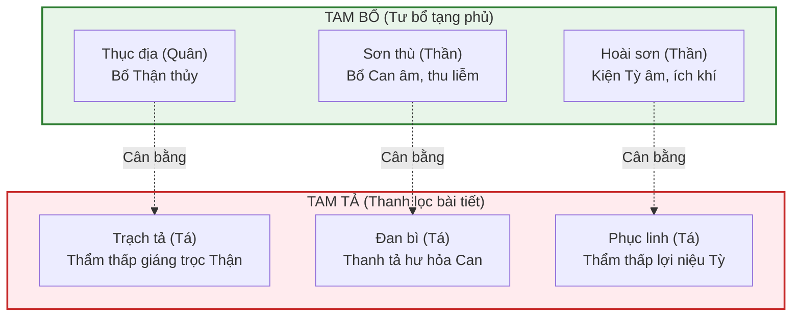

# Chương XII: Lý luận các phép Bổ trong Phương tễ học

Phép Bổ (Bổ pháp - 補法) là một trong tám phép trị bệnh cốt lõi (Bát pháp) của Y học cổ truyền, bao gồm: **Hãn** (ra mồ hôi), **Thổ** (gây nôn), **Hạ** (tẩy xổ), **Hòa** (hòa giải), **Ôn** (ôn ấm), **Thanh** (thanh nhiệt), **Tiêu** (tiêu tích) và **Bổ** (bồi bổ). 

Theo nguyên tắc biện chứng lâm sàng *"Hư tắc bổ chi"*, phép bổ được chỉ định cho các hội chứng bệnh lý thuộc **Hư chứng** (Khí hư, Huyết hư, Âm hư, Dương hư) nhằm phục hồi chính khí, nâng cao khả năng tự phòng vệ và thiết lập lại sự cân bằng âm dương của cơ thể.

---

## 1. Đại cương về Bổ pháp (補法)

Bổ pháp không đơn thuần là sử dụng các vị thuốc bổ dưỡng chất, mà là một nghệ thuật điều phối khí hóa tạng phủ. Đông y phân loại các thể hư tổn thành bốn nhóm chính, tương ứng với bốn phép bổ cốt lõi:

*   **Bổ Khí**: Dùng cho chứng Khí hư (Phế tỳ khí hư), biểu hiện bằng hơi thở ngắn, mệt mỏi, ăn kém, sa tạng phủ.
*   **Bổ Huyết**: Dùng cho chứng Huyết hư (Tâm tạng Can huyết hư), biểu hiện bằng da nhợt nhạt, hoa mắt, mất ngủ, kinh ít.
*   **Bổ Âm**: Dùng cho chứng Âm hư (chân âm hao tổn, hư hỏa bốc lên), biểu hiện bằng triều nhiệt, mồ hôi trộm, lưỡi đỏ ít rêu.
*   **Bổ Dương**: Dùng cho chứng Dương hư (mệnh môn hỏa suy, mất khả năng sưởi ấm), biểu hiện bằng sợ lạnh, tay chân lạnh, liệt dương.

> [!IMPORTANT]
> **Nguyên tắc lâm sàng tối quan trọng khi dùng phép bổ:**
> 1. **Bổ nhi bất trệ (Bổ không gây đình trệ):** Thuốc bổ dưỡng thường có tính chất nê trệ (dính, nặng, khó tiêu hóa), dễ làm tắc trở tỳ vị. Vì vậy, luôn cần phối hợp với các vị thuốc hành khí, kiện tỳ nhẹ (như Trần bì, Sa nhân) để giúp cơ thể hấp thu dược tính dễ dàng.
> 2. **Phối hợp Bổ - Tả hợp lý:** Hư chứng lâu ngày thường đi kèm với đàm ẩm, huyết ứ, hoặc nhiệt độc tích tụ. Dùng thuốc thuần bổ lúc này sẽ làm tà khí bị giữ lại bên trong (*Vô thực thực, vô hư hư* - giữ giặc trong nhà). Do đó, phải phối hợp vị thuốc tả (thông lợi, tiêu ứ) để khai thông đường lối cho vị thuốc bổ đi vào.

---

## 2. Phương tễ Bổ Khí (補氣劑)

### Lý luận lâm sàng
Khí là động lực của sự sống, chủ về thúc đẩy, sưởi ấm, bảo vệ và cố nhiếp dịch thể. Khí hư chủ yếu liên quan đến hai tạng **Tỳ** (nơi sinh hóa khí huyết) và **Phế** (nơi chủ hô hấp, thu nạp thanh khí).
*   **Triệu chứng điển hình**: Đoản hơi, tự hãn (mồ hôi tự chảy ra khi hoạt động nhẹ), sắc mặt nhợt nhạt, tiếng nói nhỏ, mệt mỏi rã rời, ăn uống khó tiêu, đại tiện phân nát, sa tử cung hoặc sa trực tràng.
*   **Nguyên tắc lập phương**: Sử dụng các vị thuốc ngọt ấm (Cam ôn) để kiện tỳ vị và ích phế khí làm chủ đạo.

### Bài thuốc kinh điển phân tích

#### A. Tứ Quân Tử Thang (四君子湯)
*   **Thành phần**: Nhân sâm, Bạch truật, Phục linh, Cam thảo.
*   **Ý nghĩa**: Đây là bài thuốc gốc (tổ phương) của tất cả các bài thuốc bổ khí kiện tỳ. Cấu trúc phối ngũ vô cùng bình hòa, giống như phẩm chất trung dung của người quân tử:

| Vị thuốc | Vai trò | Liều lượng (tham khảo) | Công năng phối ngũ |
| :--- | :--- | :--- | :--- |
| **Nhân sâm** | Quân | 9 - 12g | Vị ngọt, tính ôn. Đại bổ nguyên khí, kiện tỳ dưỡng vị, bổ phế ích khí. |
| **Bạch truật** | Thần | 9 - 12g | Vị đắng ngọt, tính ấm. Táo thấp kiện tỳ, giúp tăng cường chức năng vận hóa tỳ vị. |
| **Phục linh** | Tá | 9 - 12g | Vị ngọt nhạt, tính bình. Thẩm thấp lợi thủy. Phối hợp Bạch truật kiện tỳ, loại bỏ thấp khí tích tụ. |
| **Chích Cam thảo** | Sứ | 3 - 6g | Vị ngọt, tính ấm. Bổ trung ích khí, hòa hoãn tính dược và điều hòa các vị thuốc. |

#### B. Bổ Trung Ích Khí Thang (補中益氣湯)
*   **Thành phần**: Hoàng kỳ, Nhân sâm, Bạch truật, Chích Cam thảo, Đương quy, Trần bì, Thăng ma, Sài hồ.
*   **Lý luận chuyên sâu**: Bài thuốc do danh y Lý Đông Viên sáng lập, đại diện cho phép **Thăng đề tỳ vị trung khí**. 
    *   **Hoàng kỳ** dùng liều cao làm Quân để đại bổ phế vệ và tỳ khí. 
    *   **Nhân sâm, Bạch truật, Cam thảo** hỗ trợ bổ khí trung tiêu.
    *   **Đương quy** dưỡng huyết hòa huyết (khí hư lâu ngày dễ dẫn đến huyết hư).
    *   **Trần bì** lý khí hóa trệ, tránh để thuốc bổ gây đầy bụng.
    *   Điểm mấu chốt là cặp phối ngũ **Thăng ma** và **Sài hồ**: Hai vị này có tính chất thăng tán nhẹ nhàng, phối hợp với thuốc bổ khí để nâng đỡ dương khí bị hạ hãm, kéo các tạng phủ bị sa (sa tử cung, dạ dày, trĩ) trở lại vị trí cũ, đồng thời thanh giải hư nhiệt do tỳ vị khí hư hạ hãm gây ra.

---

## 3. Phương tễ Bổ Huyết (補血劑)

### Lý luận lâm sàng
Huyết là cơ sở vật chất của các hoạt động tinh thần và nuôi dưỡng cơ thể. Huyết do tỳ vị sinh ra, can tàng trữ và tâm vận hành. Huyết hư thường do mất máu cấp tính/mãn tính, hoặc tỳ vị hư nhược không sinh ra được huyết.
*   **Triệu chứng điển hình**: Sắc mặt nhợt nhạt hoặc vàng úa, môi móng tay chân nhợt nhạt, hoa mắt chóng mặt, ù tai, tim đập hồi hộp, mất ngủ, da khô, kinh nguyệt lượng ít, sắc nhạt hoặc bế kinh, mạch tế vô lực.
*   **Nguyên tắc lập phương**: Dưỡng huyết nhu can kết hợp bổ khí sinh huyết.

### Bài thuốc kinh điển phân tích

#### A. Tứ Vật Thang (四物湯)
*   **Thành phần**: Thục địa, Đương quy, Bạch thược, Xuyên khung.
*   **Ý nghĩa**: Bài thuốc gốc về bổ huyết điều kinh. Tứ Vật Thang bổ huyết mà không trệ nhờ sự kết hợp hài hòa giữa các vị thuốc tĩnh (tư dưỡng) và các vị thuốc động (hoạt huyết):

| Vị thuốc | Vai trò | Tính chất dược lý | Công năng phối ngũ |
| :--- | :--- | :--- | :--- |
| **Thục địa** | Quân | Tĩnh | Vị ngọt mặn, tính ấm. Đại bổ thận tinh, tư âm dưỡng huyết, là vị thuốc cốt lõi sinh huyết. |
| **Đương quy** | Thần | Động / Tĩnh | Vị ngọt cay, tính ấm. Vừa dưỡng huyết vừa hoạt huyết thông kinh, giải quyết ứ trệ. |
| **Bạch thược** | Tá | Tĩnh | Vị đắng chua, tính hơi hàn. Liễm âm dưỡng huyết, nhu can giảm đau co thắt sườn bụng. |
| **Xuyên khung** | Tá/Sứ | Động | Vị cay, tính ấm. Hành khí hoạt huyết trong huyết quản, giúp huyết lưu thông tốt, tránh nê trệ. |

#### B. Đương Quy Bổ Huyết Thang (當歸補血湯)
*   **Thành phần**: Hoàng kỳ (30g) và Đương quy (6g) (Tỷ lệ vàng **5:1** kinh điển).
*   **Lý luận chuyên sâu**: Đây là bài thuốc bổ huyết nhưng lượng thuốc bổ khí (**Hoàng kỳ**) cao gấp 5 lần thuốc bổ huyết (**Đương quy**). 
    *   Theo học thuyết Đông y, *"Khí năng sinh huyết"* (Khí sinh ra huyết) và *"Huyết vi khí chi mẫu, khí vi huyết chi soái"* (Khí dẫn đường cho huyết). Khi cơ thể bị mất máu nặng hoặc thiếu máu nghiêm trọng, âm huyết tiêu hao kéo theo khí thoát. 
    *   Hoàng kỳ đại bổ phế tỳ khí giúp kích thích tạng tỳ tăng cường sinh hóa huyết dịch từ thức ăn, đồng thời giữ cho huyết không chạy tràn lan. 
    *   Đương quy đóng vai trò dưỡng huyết môn. Sự phối hợp liều lượng chênh lệch này giúp sinh huyết vô cùng nhanh chóng trên lâm sàng.

---

## 4. Phương tễ Bổ Âm (補陰劑)

### Lý luận lâm sàng
Âm dịch bao gồm tinh, tủy, tân, dịch có vai trò nhu nhuận, sưởi mát và ức chế sự quá thịnh của dương hỏa. Thận âm là gốc rễ của âm dịch toàn thân. Khi âm dịch suy tổn, hư hỏa sẽ bùng phát.
*   **Triệu chứng điển hình**: Sốt hâm hấp về chiều (triều nhiệt), lòng bàn tay bàn chân nóng (ngũ tâm phiền nhiệt), ra mồ hôi trộm khi ngủ (đạo hãn), miệng khô ráo, họng khát nước, sụt cân, di tinh, mạch tế sác, chất lưỡi đỏ thon khô, ít hoặc không có rêu lưỡi.
*   **Nguyên tắc lập phương**: Tư âm giáng hỏa, ngọt mát tư nhuận (Cam hàn tư dịch).

### Bài thuốc kinh điển phân tích

#### A. Lục Vị Địa Hoàng Hoàn (六味地黃丸)
*   **Thành phần**: Thục địa, Sơn thù du, Hoài sơn, Trạch tả, Đan bì, Phục linh.
*   **Lý luận chuyên sâu**: Bài thuốc do danh y Tiền Ất sáng lập để trị chứng thận âm hư ở trẻ em, sau trở thành bài thuốc tư Can Thận âm kinh điển nhất. Bài thuốc thiết kế theo nguyên tắc **Tam bổ - Tam tả** vô cùng hoàn mỹ, cân bằng ngũ hành:

*   **Thục địa** tư bổ thận thủy kết hợp **Trạch tả** thẩm thấp giáng trọc, giúp bổ Thận mà không lo bí trệ đường thủy.
*   **Sơn thù du** dưỡng can huyết kết hợp **Đan bì** thanh tả can hỏa vượng, giúp dưỡng Can mà không sợ uất hỏa tích tụ.
*   **Hoài sơn** bổ tỳ ích âm kết hợp **Phục linh** thẩm tỳ thấp, giúp tỳ vị vận hóa tốt, hấp thu trọn vẹn dược tính.

#### B. Tả Quy Hoàn (左歸丸)
*   **Thành phần**: Thục địa, Hoài sơn, Sơn thù, Câu kỷ tử, Thỏ ty tử, Hoài ngưu tất, Lộc giác giao, Quy bản giao.
*   **Lý luận chuyên sâu**: Sáng lập bởi Trương Cảnh Nhạc dựa trên triết lý *"Thuần bổ vô tả"*. 
    *   Khác với Lục Vị Địa Hoàng Hoàn có pha trộn các vị thuốc tả (Trạch tả, Đan bì, Phục linh) để giải quyết thấp nhiệt nhẹ, Tả Quy Hoàn dùng cho chứng chân âm hư tổn nặng, tinh tủy cạn kiệt. 
    *   Bài thuốc loại bỏ hoàn toàn các vị thông lợi, thay vào đó bổ sung các vị chí âm tinh huyết như **Quy bản giao** (cao yếm rùa), **Lộc giác giao** (cao sừng hươu) để "kéo nước nguồn về" tư bổ tủy xương sâu sắc. Thích hợp cho người suy kiệt thể chất nặng, vô sinh, suy tủy âm.

---

## 5. Phương tễ Bổ Dương (補陽劑)

### Lý luận lâm sàng
Dương khí là nguồn năng lượng sưởi ấm, khí hóa và thúc đẩy toàn bộ tạng phủ hoạt động. Thận dương (mệnh môn hỏa) là gốc của dương khí toàn thân. Dương hư thường do thận dương suy yếu, không thể ôn ấm cơ thể.
*   **Triệu chứng điển hình**: Sợ lạnh, thích ấm, chân tay lạnh giá, đau lưng mỏi gối thể hàn, tiểu đêm nhiều lần, nước tiểu trong dài, di tinh liệt dương, ngũ canh tả (đi ngoài lỏng lúc sáng sớm do tỳ thận dương hư), mạch trầm trì vô lực.
*   **Nguyên tắc lập phương**: Ôn bổ mệnh môn hỏa, ôn dương cứu nghịch, "trong âm cầu dương".

### Bài thuốc kinh điển phân tích

#### A. Kim Quỹ Thận Khí Hoàn (金匱腎氣丸)
*   **Thành phần**: Thục địa, Hoài sơn, Sơn thù, Trạch tả, Đan bì, Phục linh, Phụ tử chế, Nhục quế.
*   **Lý luận chuyên sâu**: Bài thuốc do Trương Trọng Cảnh sáng lập trong sách *Thương Hàn Tạp Bệnh Luận*. Cấu trúc phối ngũ của bài thuốc thể hiện triết lý âm dương vô cùng thâm thúy:
    *   Bài thuốc sử dụng toàn bộ khung xương của bài **Lục Vị Địa Hoàng Hoàn** (cam hàn tư âm) làm nền tảng bổ âm, nhưng bổ sung thêm hai vị thuốc nóng ấm cực mạnh là **Phụ tử chế** và **Nhục quế** với liều lượng cực nhỏ (chỉ chiếm khoảng 1/10 đến 1/12 tổng lượng bài thuốc).
    *   Trương Trọng Cảnh không dùng bài thuốc thuần nóng (thuần cương dương) để bổ dương, mà dùng lượng lớn thuốc bổ âm để dưỡng tinh tủy, sau đó dùng lượng nhỏ Phụ tử và Nhục quế để nhen nhóm sinh hóa ra dương khí. Triết lý này gọi là **"Trong Âm cầu Dương"**: dương khí sinh ra từ nguồn âm tinh dồi dào sẽ ôn hòa, lâu bền và không bị bốc hỏa, khô kiệt tân dịch dịch thể (*"Dương đắc Âm trợ nhi sinh hóa vô cùng"*).

#### B. Hữu Quy Hoàn (右歸丸)
*   **Thành phần**: Thục địa, Sơn thù, Hoài sơn, Câu kỷ tử, Đỗ trọng, Đương quy, Thỏ ty tử, Phụ tử chế, Nhục quế, Lộc giác giao.
*   **Lý luận chuyên sâu**: Cũng do Trương Cảnh Nhạc sáng lập để trị chứng thận dương hư tổn nặng, mệnh môn hỏa suy kiệt hoàn toàn. 
    *   Bài thuốc loại bỏ hoàn toàn các vị tả của Thận khí hoàn, tăng cường bổ thận trợ dương bằng Phụ tử, Nhục quế, Lộc giác giao, đồng thời dưỡng huyết tư tinh bằng Đương quy, Kỷ tử, Thỏ ty tử. 
    *   Đây là bài thuốc thuần bổ mệnh môn hỏa, có tác dụng ôn ấm mạnh mẽ, tái lập năng lượng sinh hóa và chức năng sưởi ấm cho tạng phủ bị suy kiệt nghiêm trọng.

---

## 6. Tổng kết so sánh các nhóm thuốc bổ

Bảng đối chiếu tổng quan bốn nhóm phương tễ bổ ích cốt lõi:

| Nhóm bài thuốc | Thể bệnh chỉ định | Triệu chứng cốt lõi | Bài thuốc tiêu biểu | Vị thuốc chủ lực | Lưu ý phối ngũ lâm sàng |
| :--- | :--- | :--- | :--- | :--- | :--- |
| **Bổ Khí** | Tỳ phế khí hư | Đoản hơi, mệt mỏi, sa tạng | Tứ Quân Tử Thang | Nhân sâm, Hoàng kỳ | Phối hợp vị lý khí (Trần bì) để tránh đầy trướng. |
| **Bổ Huyết** | Tâm can huyết hư | Mặt xanh nhợt, kinh ít, hoa mắt | Tứ Vật Thang | Thục địa, Đương quy | Phối hợp vị bổ khí (Hoàng kỳ) để tăng sinh huyết. |
| **Bổ Âm** | Thận can âm hư | Sốt chiều, mồ hôi trộm, lưỡi đỏ | Lục Vị Địa Hoàng Hoàn | Thục địa, Câu kỷ tử | Phối hợp vị thanh hư nhiệt (Địa cốt bì, Tri mẫu). |
| **Bổ Dương** | Thận dương hư suy | Sợ lạnh, tay chân lạnh, tiểu đêm | Kim Quỹ Thận Khí Hoàn | Phụ tử chế, Nhục quế | Áp dụng "trong âm cầu dương" phối hợp thuốc tư âm. |
