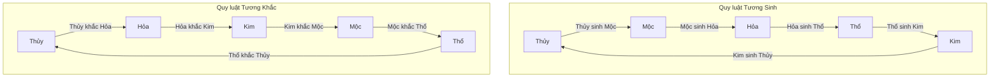

# CHƯƠNG II: HỌC THUYẾT NGŨ HÀNH (THE FIVE ELEMENTS THEORY)

Học thuyết Ngũ Hành giải thích mối quan hệ tương tác hữu cơ, thúc đẩy phát triển và chế ước lẫn nhau giữa các tạng phủ trong cơ thể dựa trên quy luật vận động của 5 trạng thái động (Hành) cơ bản trong tự nhiên: Mộc, Hỏa, Thổ, Kim, Thủy. Sự thăng trầm của các hành này phản ánh sinh động sức khỏe toàn diện của cơ thể con người.

---

## 1. Bản chất của Ngũ Hành và Hệ thống Phân loại Vũ trụ

Trong triết học phương Đông, **Hành** không có nghĩa là vật chất tĩnh lặng hay các nguyên tố hóa học cố định, mà đại diện cho **xu hướng vận động và biến đổi** khí hóa của vũ trụ.

*   **Mộc (Mộc khí - Sinh trưởng)**: Đặc tính sinh trưởng, vươn tỏa, làm cho thông thoáng (thăng phát, điều đạt). Can thuộc Mộc vì tạng Can chủ sơ tiết khí huyết, ghét sự uất giận tù túng, thích tự do vươn tỏa như cành cây mùa xuân.
*   **Hỏa (Hỏa khí - Phát triển)**: Đặc tính ấm nóng, bùng phát hướng lên trên (viêm thượng). Tâm thuộc Hỏa vì tạng Tâm làm chủ thần minh, mang sức nóng ấm thúc đẩy tuần hoàn máu và điều khiển tâm trí.
*   **Thổ (Thổ khí - Chuyển hóa)**: Đặc tính nâng đỡ, thu nhận, nuôi dưỡng và chuyển hóa (hóa sinh, tải vật). Tỳ thuộc Thổ vì tỳ vị vận hóa thủy cốc (tiêu hóa thức ăn), chiết tách tinh hoa để nuôi sống toàn bộ tạng phủ khác (được coi là "Hậu thiên chi bản").
*   **Kim (Kim khí - Thu liễm)**: Đặc tính rắn rỏi, thanh lọc, thu liễm và làm sạch (túc giáng, thu sát). Phế thuộc Kim vì tạng Phế chủ hô hấp, đưa dưỡng khí đi xuống (túc giáng) để nuôi cơ thể và lọc sạch đờm nhớt bụi bẩn ra ngoài.
*   **Thủy (Thủy khí - Tích trữ)**: Đặc tính ẩm ướt, lạnh lẽo, có xu hướng chảy xuống dưới và ẩn kín (nhuận hạ, bế tàng). Thận thuộc Thủy vì tạng Thận chủ thủy dịch, quản lý lượng nước lọc và lưu trữ tinh hoa sinh mệnh của cơ thể (được coi là "Tiên thiên chi bản").

### Bảng Hệ thống Quy nạp Ngũ Hành trong Tự nhiên và Con người:

| Hành | Mộc | Hỏa | Thổ | Kim | Thủy |
| :--- | :--- | :--- | :--- | :--- | :--- |
| **Mùa (Tự nhiên)** | Mùa Xuân | Mùa Hạ | Cuối Hạ (Trưởng Hạ) | Mùa Thu | Mùa Đông |
| **Phương hướng** | Phương Đông | Phương Nam | Trung tâm | Phương Tây | Phương Bắc |
| **Khí hậu** | Phong (Gió) | Thử, Nhiệt (Nóng) | Thấp (Ẩm ướt) | Táo (Khô ráo) | Hàn (Lạnh) |
| **Màu sắc** | Xanh (Thanh) | Đỏ (Xích) | Vàng (Hoàng) | Trắng (Bạch) | Đen (Hắc) |
| **Vị (Nếm)** | Chua (Toan) | Đắng (Khổ) | Ngọt (Cam) | Cay (Tân) | Mặn (Hàm) |
| **Tạng (Âm)** | **Can** (Gan) | **Tâm** (Tim) | **Tỳ** (Lá lách) | **Phế** (Phổi) | **Thận** (Thận) |
| **Phủ (Dương)** | Đởm (Mật) | Tiểu trường (Ruột non) | Vị (Dạ dày) | Đại trường (Ruột già) | Bàng quang (Bóng đái) |
| **Ngũ thể** | Cân (Gân cơ) | Mạch (Mạch máu) | Cơ nhục (Thịt) | Bì lông (Da lông) | Cốt tủy (Xương răng) |
| **Ngũ quan** | Mục (Mắt) | Thiệt (Lưỡi) | Khẩu (Miệng) | Tỳ (Mũi) | Nhĩ (Tai) |
| **Cảm xúc (Chí)** | Giận dữ (Nộ) | Vui mừng (Hỷ) | Lo nghĩ (Ưu tư) | Buồn rầu (Bi) | Sợ hãi (Khủng) |
| **Âm thanh** | Kêu la (Hô) | Cười (Tiếu) | Hát (Ca) | Khóc (Khốc) | Than thở (Thân) |
| **Tân dịch** | Lệ (Nước mắt) | Hãn (Mồ hôi) | Diên (Nước bọt trong) | Nước mũi (Sổ) |唾 (Nước bọt đặc) |


---

## 2. Quy luật Tương tác Ngũ Hành trên Lâm sàng

Sự sống khỏe mạnh của cơ thể dựa trên sự cân bằng giữa hai lực đối trọng: **Tương Sinh** (thúc đẩy, nuôi dưỡng) và **Tương Khắc** (kiềm chế, giữ thăng bằng). Nếu mất đi một trong hai lực này, sinh mệnh lập tức suy sụp.



### A. Quy luật Tương sinh (Hành này sinh ra và nuôi dưỡng Hành kia)
Mối quan hệ tương sinh được ví như quan hệ **Mẹ - Con (Mẫu - Tử)**:
*   **Thủy sinh Mộc** (Thận thủy sinh Can mộc): Thận tinh (Thủy) đầy đủ sẽ hóa sinh thành huyết dịch để nuôi dưỡng cho Can huyết (Mộc) dồi dào.
*   **Mộc sinh Hỏa** (Can mộc sinh Tâm hỏa): Can tàng trữ huyết dịch (Mộc) tốt sẽ cung cấp vật chất để Tâm (Hỏa) làm chủ mạch máu và thần chí.
*   **Hỏa sinh Thổ** (Tâm hỏa sinh Tỳ thổ): Nhiệt lượng từ Tâm dương (Hỏa) sưởi ấm cho Tỳ vị (Thổ) hoạt động vận hóa thức ăn trơn tru.
*   **Thổ sinh Kim** (Tỳ thổ sinh Phế kim): Tỳ vận hóa dưỡng chất tốt sẽ đưa chất tinh hoa lên phế quản, nuôi dưỡng Phế khí (Kim) khỏe mạnh.
*   **Kim sinh Thủy** (Phế kim sinh Thận thủy): Phế khí thanh sạch đi xuống (túc giáng) dẫn thủy dịch đưa xuống hạ tiêu bồi bổ cho Thận tinh (Thủy).

### B. Quy luật Tương khắc (Hành này chế ngự và giới hạn Hành kia)
Nhằm tránh một hành phát triển quá mức gây hại cho cơ thể (như đê điều giữ nước lũ):
*   **Mộc khắc Thổ** (Can khắc Tỳ): Can sơ tiết khí cơ làm thông thoáng, giúp Tỳ vị không bị uất trệ tích ẩm.
*   **Thổ khắc Thủy** (Tỳ khắc Thận): Tỳ vận hóa thủy dịch tốt giúp Thận không bị ngập lụt gây phù thũng.
*   **Thủy khắc Hỏa** (Thận khắc Tâm): Thận thủy đi lên làm mát Tâm hỏa, tránh hỏa bùng phát gây bồn chồn mất ngủ.
*   **Hỏa khắc Kim** (Tâm khắc Phế): Sức nóng của Tâm dương sưởi ấm giúp Phế khí không bị lạnh buốt phổi.
*   **Kim khắc Mộc** (Phế khắc Can): Phế khí thanh giáng giữ cho Can khí không bốc hỏa lên đỉnh đầu.

---

## 3. Cơ chế Bệnh lý Ngũ Hành (Trạng thái Thiên lệch Bất thường)

Khi cơ thể suy yếu hoặc tà khí xâm nhập quá mạnh, mối quan hệ bình thường sẽ biến dạng thành trạng thái bệnh lý:

### 1. Tương thừa (Khắc phạt quá mức)
Hành khắc lấn lướt quá mạnh vào hành bị khắc khi hành bị khắc đang suy yếu.
*   *Ví dụ bệnh lý*: Chứng **Can Tỳ bất hòa** (Can mộc thừa Tỳ thổ). Khi căng thẳng thần kinh hay tức giận (Can khí uất kết mạnh), Can khí sẽ khắc phạt dữ dội vào Tỳ vị đang yếu, gây co thắt dạ dày, đau bụng tiêu chảy, ăn không tiêu.

### 2. Tương vũ (Khắc ngược lại - Khinh nhờn)
Hành bị khắc quá vượng hoặc hành khắc quá suy yếu làm hành bị khắc phản kháng ngược lại.
*   *Ví dụ bệnh lý*: Chứng **Can hỏa phạm phế** (Mộc vũ Kim). Bình thường Kim khắc Mộc (Phế kiềm chế Can). Khi u uất hóa hỏa (Can mộc quá mạnh), Can hỏa sẽ bùng phát thiêu đốt Phế kim, gây ho khan dữ dội, đau tức sườn ngực, nặng thì ho ra máu.

### 3. Mẫu tử tương cập (Mẹ con truyền bệnh cho nhau)
*   **Mẫu bệnh cập tử (Mẹ truyền cho Con)**: Thận thủy suy yếu không nuôi dưỡng được Can mộc (Thủy bất hàm mộc) dẫn đến chứng Can âm hư gây hoa mắt chóng mặt, ù tai, co rút gân cơ.
*   **Tử bệnh cập mẫu (Con hại lại Mẹ)**: Phế khí hư lâu ngày (Con) ảnh hưởng ngược lên Tỳ vị (Mẹ), khiến người bệnh ăn uống kém, gầy yếu đi (Tử bệnh cập mẫu).

---

## 4. Ứng dụng trong Chẩn đoán và Nguyên tắc Điều trị YHCT

### Biện pháp Chẩn đoán qua Sắc diện và Vị giác:
Thầy thuốc nhìn sắc mặt để tìm nguồn gốc tạng hư hỏng:
*   Mặt xanh mét xám xịt -> Bệnh ở tạng Can.
*   Mặt đỏ bừng -> Bệnh ở tạng Tâm.
*   Mặt vàng úa bủng -> Bệnh ở tạng Tỳ.
*   Mặt trắng bệch -> Bệnh ở tạng Phế.
*   Mặt tối sẫm đen xạm -> Bệnh ở tạng Thận.

### Nguyên tắc Điều trị: "Hư bổ kỳ mẫu, thực tả kỳ tử"
*   **Khi tạng phủ bị HƯ (suy nhược)**: Không chỉ bổ trực tiếp tạng đó mà phải **BỔ TẠNG MẸ** của nó.
    *   *Ví dụ*: Phế khí hư (ho hen kéo dài, người gầy) -> Dùng phương pháp **"Bồi thổ sinh kim"** (Bổ Tỳ Thổ để sinh Phế Kim). Thay vì chỉ dùng thuốc bổ phổi, ta bổ thêm Tỳ vị bằng Bạch truật, Hoài sơn để hệ tiêu hóa tốt hơn, tự khắc phổi sẽ khỏe lên.
*   **Khi tạng phủ bị THỰC (dư thừa, viêm cấp)**: Phải **TẢ TẠNG CON** của nó để rút bớt năng lượng dư thừa.
    *   *Ví dụ*: Can hỏa vượng (đỏ mắt, giận dữ, huyết áp cao) -> Ta **Tả Tâm hỏa** (Con của Can mộc) bằng các vị thuốc thanh tâm tả hỏa như Đan bì, Chi tử để hạ hỏa lực của Can xuống.

---

## 5. Minh họa Dược tính Ngũ Hành qua hình ảnh Dược liệu

Mỗi hành được đại diện bởi một vị thuốc đặc trưng qua màu sắc, tính vị và hình ảnh minh họa chân thực:

### 1. Hành Mộc (Tạng Can - Màu xanh/xám, vị chua): Bạch thược (白芍)


*   **Đặc điểm hình ảnh**: Lát thái Bạch thược mỏng dẹt, viền ngoài màu xám xanh vỏ cây rễ cổ, ruột gỗ bên trong màu trắng hồng mịn màng óng ả. Sự dịu nhẹ của đường nét lát thuốc tượng trưng cho tính chất nhu hòa, làm mềm gân cơ của hành Mộc.
*   **Lý luận Dược tính**: Vị đắng chua (toan), tính hơi mát. Vị chua đi thẳng vào tạng Can. Tính chua có tác dụng thu liễm âm huyết, dưỡng huyết nhu Can, giúp làm dịu sự căng thẳng của gân (cân), hạ cơn bốc hỏa của Can khí uất kết.

### 2. Hành Hỏa (Tạng Tâm - Màu đỏ/nâu đỏ, vị đắng): Đan bì (丹皮)


*   **Đặc điểm hình ảnh**: Vỏ rễ Đan bì cuộn tròn hình ống rỗng ruột. Mặt ngoài vỏ có màu nâu đỏ hoặc hồng sậm đặc trưng của hành Hỏa (sắc xích). Mặt cắt thớ vỏ thô xù xì, đôi khi lấp lánh các tinh thể trắng nhỏ của paeonol. Sắc đỏ rực rỡ và hình dáng ống rỗng (tượng trưng cho lòng mạch máu) dẫn thẳng công năng vào hệ tuần hoàn của tạng Tâm.
*   **Lý luận Dược tính**: Vị cay đắng, tính hơi hàn. Vị đắng lạnh (khổ hàn) đi vào tạng Tâm để thanh tả tâm hỏa, lương huyết (làm mát máu) và tiêu trừ nhiệt độc ứ tụ gây tắc nghẽn trong lòng mạch máu.

### 3. Hành Thổ (Tạng Tỳ - Màu vàng/nâu đất, vị ngọt): Bạch truật (白朮)


*   **Đặc điểm hình ảnh**: Khối củ Bạch truật sần sùi màu vàng đất nhạt hoặc nâu vàng khô ráo, kết cấu thô mộc xơ gỗ. Vẻ ngoài mộc mạc như đất đá cằn cỗi đại diện cho hành Thổ vững chãi. Nó thể hiện tính năng hút ẩm (táo thấp) mạnh mẽ của vị thuốc.
*   **Lý luận Dược tính**: Vị ngọt đắng, tính ấm. Vị ngọt ấm giúp bổ trung ích khí cho tỳ vị, vị đắng khô giúp táo thấp (làm khô ráo tỳ vị khỏi đờm ẩm), thúc đẩy hệ tiêu hóa vận hóa chất dinh dưỡng nuôi cơ thể.

### 4. Hành Kim (Tạng Phế - Màu trắng/bạc, vị cay): Bạc hà (薄荷)


*   **Đặc điểm hình ảnh**: Nhánh lá Bạc hà xanh nhạt có viền răng cưa sắc nét, trên bề mặt phủ một lớp lông tơ trắng mịn ánh bạc dưới nắng. Màu sắc thanh khiết ánh bạc đại diện cho hành Kim và sự trong lành của tạng Phế. Lá mỏng nhẹ thể hiện tính chất thăng nổi, phát tán khí cơ của thuốc.
*   **Lý luận Dược tính**: Vị cay, tính mát, chứa nhiều tinh dầu bay hơi. Vị cay thơm nhẹ dễ bay hơi đi thẳng vào tạng Phế giúp phát tán phong nhiệt ở phần biểu, tuyên phế thông mũi họng, giải trừ ngoại cảm phong nhiệt.

### 5. Hành Thủy (Tạng Thận - Màu đen/tối, vị ngọt mặn): Thục địa (熟地)


*   **Đặc điểm hình ảnh**: Khối củ đen sẫm óng ánh nhựa mật, dẻo quánh, dính tay khi bẻ. Màu đen sâu thẳm thuộc hành Thủy dẫn thuốc chạy sâu xuống hạ tiêu (tạng Thận). Chất lượng nặng nề, đặc dẻo của củ thể hiện khả năng lưu trữ dưỡng chất và điền tinh tủy tối đa.
*   **Lý luận Dược tính**: Vị ngọt ngọt, tính ấm nhẹ. Đi sâu vào hạ tiêu bồi bổ chân âm dịch thể cho tạng Thận, làm đầy tủy xương cốt và nuôi tóc đen mượt.

---

## 6. Phân tích Phối ngũ Phương tễ Ngũ Hành: Lục Vị Địa Hoàng Hoàn

Sự tương tác Ngũ Hành được thể hiện đỉnh cao trong bài thuốc cổ phương nổi tiếng **Lục Vị Địa Hoàng Hoàn** (chuyên bổ thận âm). Bài thuốc là một động cơ Ngũ Hành khép kín gồm **3 vị bổ (Tam bổ)** và **3 vị tả (Tam tả)** giúp điều phối nhịp nhàng các hành:

```
[TAM BỔ - Hướng tâm, bồi bổ]
Thục địa (Thủy) ----------> Bổ Thận Thủy (Nguồn gốc)
Sơn thù du (Mộc) ---------> Bổ Can Mộc (Giữ tinh hoa)
Hoài sơn (Thổ) -----------> Bổ Tỳ Thổ (Sinh dưỡng chất)

[TAM TẢ - Ly tâm, thanh lọc]
Trạch tả (Thủy) ----------> Tả Thận Thủy (Trừ thủy thũng)
Đan bì (Hỏa) -------------> Tả Can Hỏa (Thanh hư nhiệt)
Phục linh (Thổ) ----------> Tả Tỳ Thấp (Thông tiểu tiện)
```

### Sự vận hành phối hợp các hành thảo dược:

1.  **Thục địa (熟地) - Hành Thủy - Bổ Thận**: 
    *   *Ảnh minh họa*: Lát thục địa đen bóng, dẻo quánh dính nhựa mật (`/images/thuc-dia.png`).
    *   *Vận hành*: Là quân dược, trực tiếp tư bổ Thận âm (Thủy), xây dựng lại nguồn vật chất cội nguồn cho cơ thể.
2.  **Sơn thù du (山茱萸) - Hành Mộc - Bổ Can**: 
    *   *Ảnh minh họa*: Cùi quả chín phơi khô màu đỏ sẫm óng ánh (`/images/son-thu-du.png`).
    *   *Vận hành*: Là thần dược, bổ Can mộc để hỗ trợ Thận thủy (Thủy sinh Mộc). Vị chua của Sơn thù giúp giữ chặt tinh dịch không cho thất thoát ra ngoài.
3.  **Hoài sơn (懷山) - Hành Thổ - Bổ Tỳ**: 
    *   *Ảnh minh họa*: Lát củ mài màu trắng tinh khiết, mịn màng nhiều bột (`/images/hoai-son.png`).
    *   *Vận hành*: Là thần dược, bổ Tỳ thổ để tăng cường tiêu hóa. Tỳ thổ mạnh sẽ nuôi dưỡng Phế kim, từ đó Phế kim lại sinh Thận thủy (vòng tương sinh tuần hoàn).
4.  **Trạch tả (澤瀉) - Hành Thủy - Tả Thận**: 
    *   *Ảnh minh họa*: Lát củ tròn màu vàng nhạt, xốp nhẹ (`/images/trach-ta.png`).
    *   *Vận hành*: Tá dược, thông tiểu tiện để tả bớt lượng nước thừa ở tạng Thận, tránh Thục địa bổ quá sinh nuy, nuy sinh trệ.
5.  **Đan bì (丹皮) - Hành Hỏa - Tả Can**: 
    *   *Ảnh minh họa*: Vỏ rễ cuộn ống màu nâu đỏ sẫm (`/images/dan-bi.png`).
    *   *Vận hành*: Tá dược, thanh tả hỏa lực ở tạng Can (Mộc sinh Hỏa) để kiềm chế tính ấm nóng của Sơn thù, dập tắt hư nhiệt.
6.  **Phục linh (茯苓) - Hành Thổ - Tả Tỳ**: 
    *   *Ảnh minh họa*: Khối nấm màu trắng xám xốp nhẹ (`/images/phuc-linh.png`).
    *   *Vận hành*: Tá dược, lợi niệu thẩm thấp, giúp Tỳ vị khô ráo dễ hấp thụ tinh bột của Hoài sơn.

> [!TIP]
> Việc phối ngũ này là một kiệt tác của Ngũ hành: Bổ Thận (Thủy) nhưng không quên Can (Mộc) và Tỳ (Thổ). Đồng thời dùng các vị tả (Trạch tả, Đan bì, Phục linh) đi kèm để lọc sạch cặn bã, giúp các vị bổ phát huy tác dụng mà không gây tác dụng phụ uất trệ dạ dày.
